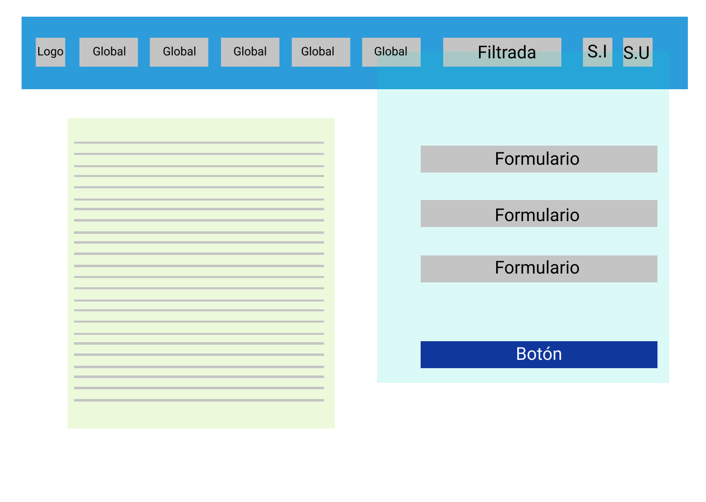
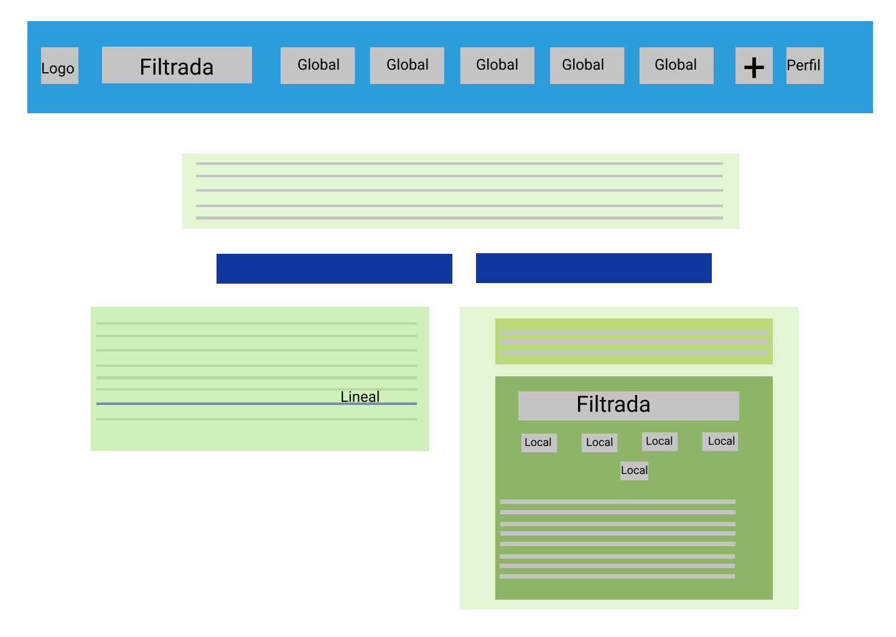
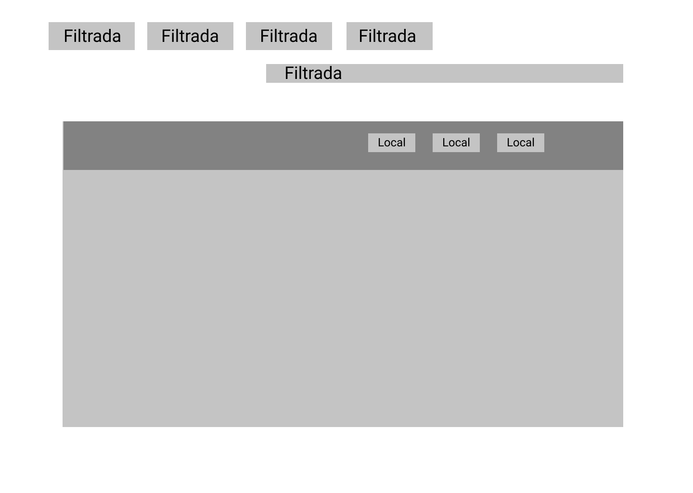
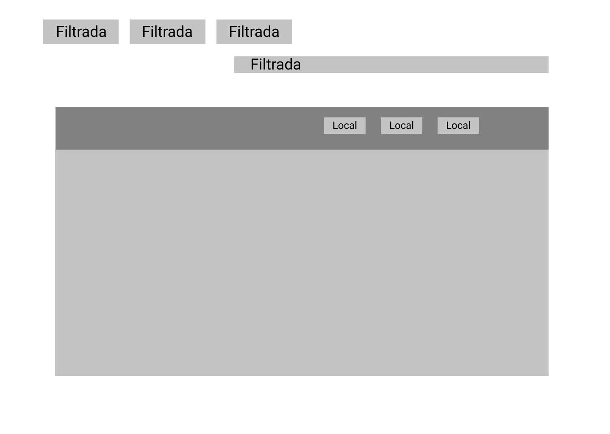
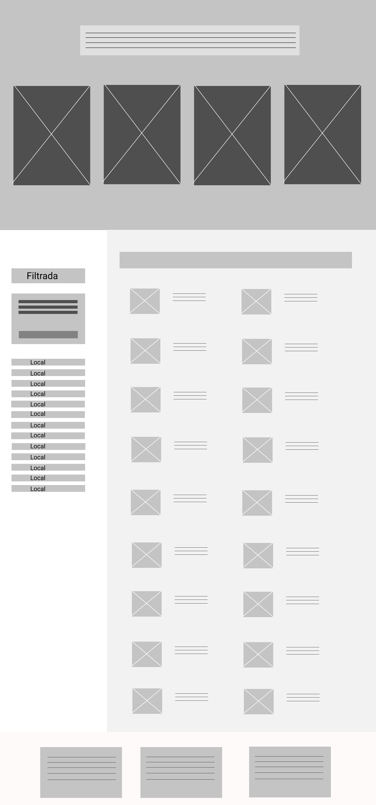
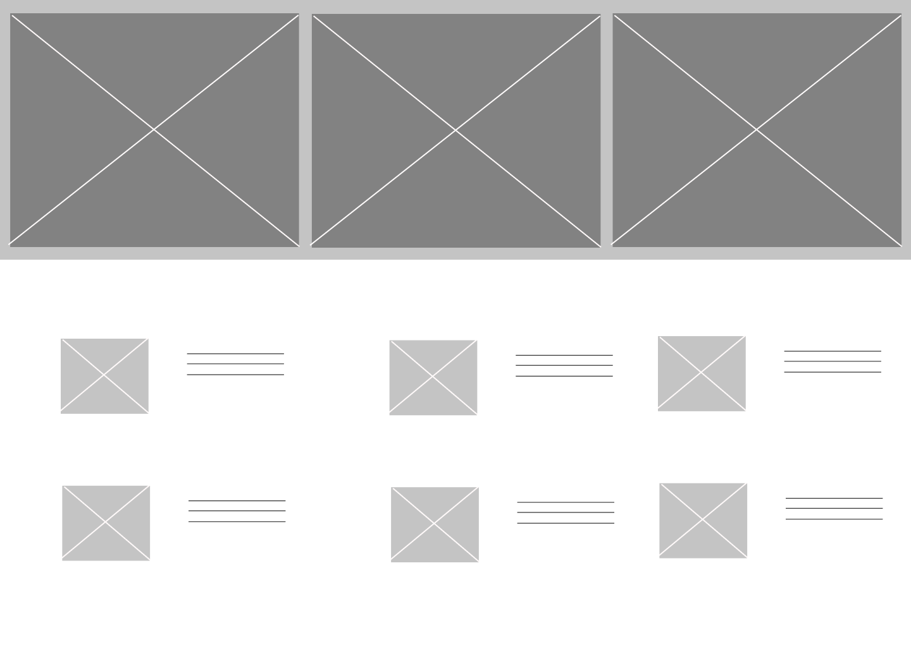
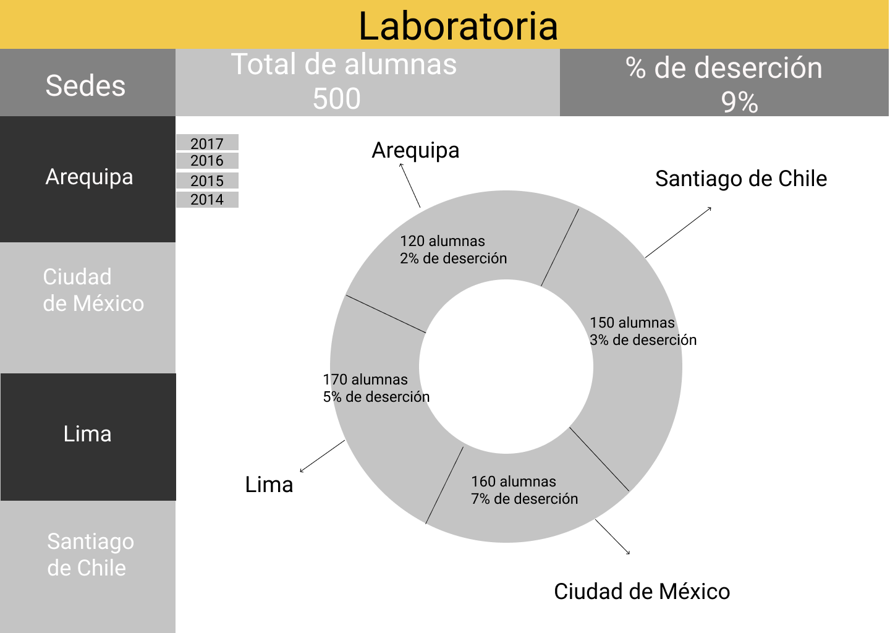
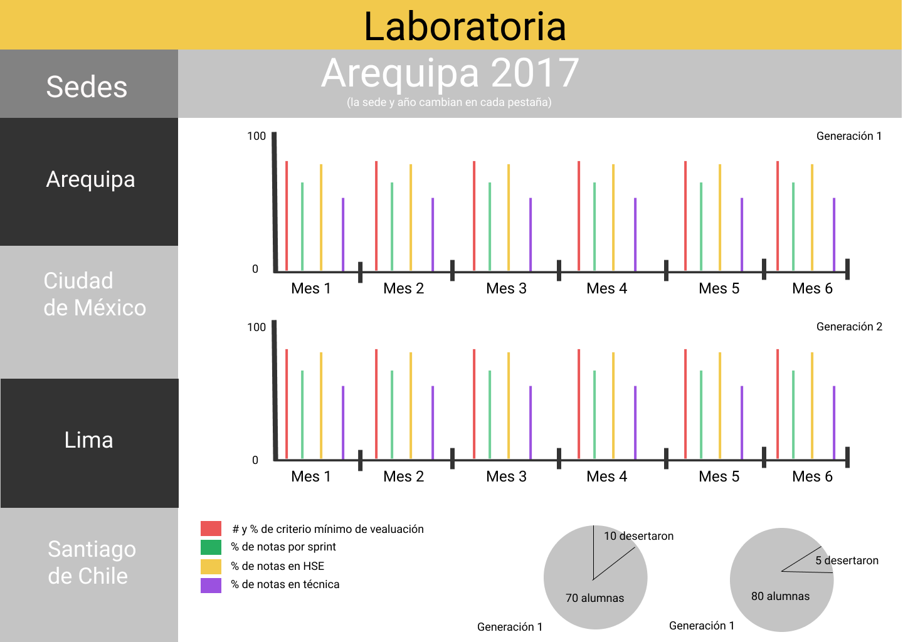

##Analisis de elementos UX y UI de la página Laboratoria##

Al ingresar a la página de Laboratoria se nos provee una vasta información sobre qué es Laboratoria y de qué manera puedes forman parte. Al hacer “scroll” sobre la página podemos darnos cuenta de que son varias las secciones que la conforman y que puedes tener más información al respecto haciendo “click” sobre los recuadros que hay en cada una.

Objetivo: El principal objetivo de la página y el giro del negocio es que mujeres jóvenes se inscriban a Laboratoria para cursar estudios de programación y posteriormente ser empleadas por alguna empresa. De este objetivo se despliegan otros con relación al éxito e impacto del programa* en el que se busca el reconocimiento a nivel mundial y la satisfacción tanto de las alumnas como de las empresas que las contratan.

A continuación describiré cada sección y su contenido considerando el UX y UI. Cada una de las secciones tiene un título según la información que se quiere dar en ese apartado.

pwdUX
- Como su nombre lo dice, el componente User  Experiences (UX) de una página web nos habla de la experiencia que el usuario tiene al interactuar con ella, que sensaciones o sentimientos le genera según la forma en la que ésta muestra su contenido.
- La página se divide en varias secciones en las que se busca proporcionar al usuario los diferentes servicios que ofrece Laboratoria, así como el reconocimiento que tiene.  
- Laboratoria se caracteriza por el empleo del color amarillo en su branding, este color lo podemos ver en varias secciones.
- La página tiene un aspecto jovial con textos breves y claros que le permiten al usuario comprender el contenido.

UI
La interfaz  presenta un color blanco que da limpieza a la página.
Todos los textos están centrados y en ellos se emplea una tipografía de palo seco. En los títulos se utiliza letras mayúsculas en negritas y de mayor tamaño para resaltar, algunos de ellos están en negro, blanco o amarillo.
Como parte complementaria del texto se utilizan fotografía que abarcan el 100% del width
Los botones o recuadros que te llevan a otras ventanas son de color amarillo con las esquinas ligeramente redondeadas.

Sección “Conoce Laboratoria y postúlate”.
Esta sección está dirigida para mujeres jóvenes que quieren postularse a Laboratoria. Es el primer encuentro que el usuario tiene al entrar a la página, donde puede tener una idea general del programa.

En la página inicial del sitio web podemos ver una fotografía con tres mujeres que portan un birrete, lo que sugiere que se están graduando.
En la parte central superior de la página se encuentra el logo de Laboratoria y en la parte central de la fotografía un texto que dice “TALENTO QUE TRANSFORMA” lo que alude que Laboratoria ofrece un talento que transforma la vida de mujeres jóvenes.
En la parte superior derecha hay un recuadro con el texto ESTUDIANTES y del lado izquierdo otro que dice EMPRESAS. Lo cual sugiere que puedes formar parte de Laboratoria de estas dos maneras. Esto también se relaciona con el texto debajo de la leyenda “TALENTO QUE TRANSFORMA”.
Al hacer “click en el recuadro que dice ESTUDIANTES te lleva a una sección en la que te proporcionan información para que te postules. Te dice qué es Laboratoria y cómo funciona, además de los criterios de selección y los pasos para postular.
En constates ocasiones podemos ver un recuadro amarillo que te sugiere que te postules y te lleva a un formulario que debes llenar con tus datos personales.
Al último podemos encontrar una sección de preguntas frecuentes por si te quedaron algunas dudas.
Al hacer “click en el recuadro que dice EMPRESAS te lleva  a una ventana que en la primera parte tiene una imagen con un recuadro que te invita a suscribirte a la página (por el momento no está en función)
En la parte superior nuevamente estás los recuadros de ESTUDIANTES y EMPRESAS
Más abajo podemos observar dos servicios que ofrece Laboratoria: capacitaciones para equipo de trabajo y el contratar a una de las graduadas
Seguido viene una serie de imágenes en las que aparecen de manera acomodada los logos de las empresas que confían en Laboratoria
Posteriormente hay un video de las personas que han formado parte de Laboratoria y un par de recuadros que te permiten ingresar a los contenidos que hace Laboratoria en su blog en la página de medium.com y en youtube
Como último hay una sección donde proporcionan una leyenda sobre Laboratoria, además de tener párrafos que te permiten contactar con ello o postularte para formar parte del equipo de Laboratoria.
Posteriormente la página te invita a hacer “scroll” hacia abajo gracias a que el icono “<” señala hacia abajo, o a hacer “click” en algunos de los dos recuadros que se encuentran en la parte superior, dependiendo de qué es lo que estés buscando.  Sin embargo, me parece que si no conoces en absoluto de Laboratoria, lo ideal sería primero ver el contenido de esta primera página y después decidir sobre cuál de los botones dar “click”.
Si haces scroll hacia abajo al inicio del siguiente recuadro hay un texto que dice POSTULA, lo cual sugiere que cualquiera puede hacerlo. Te invita a comenzar a programar, te explica brevemente lo que ofrece Laboratoria y te sugiere que comiences tú postulación al hacer “click” sobre el recuadro inferior que te lleva a la venta señala en el punto 1.3.1
Del lado izquierdo hay tres recuadros con los iconos de Facebook, Twitter e e-mail, para que en cualquier momento puedas acceder a las redes sociales de Laboratoria y comunicarte directamente.
Posteriomenete está la fotografía de una de las egresadas de Laboratoria que resume en una frase el campo laboral en el que se desempeña actualmente gracias a Laboratoria.

Sección “Conoce a las egresadas y contrátalas”
Esta sección está dirigida para empresas que quieren contratar a mujeres programadoras

Al hacer “scroll” hacia abajo hay un texto que habla sobre el perfil de las egresadas y los retos que han desarrollado a lo largo de su formación en Laboratoria, lo cual invita a las empresas a contratarlas. En la parte inferior de esta sección hay un recuadro que dice CONOCE NUESTRO TALENTO sobre el cual se puede hacer “click” para conocer a detalle el perfil de las egresadas.
Al hacer “click” te lleva a una ventana donde aparece otra fotografía con mujeres. Sobre ella nuevamente está el recuadro que dice CONOCE NUESTRO TALENTO en donde se despliega el perfil de cada una de las chicas egresadas de las generaciones anteriores. Este recuadro se encuentra en varias secciones de la ventana
Posteriormente hay una sección en la que se encuentra el logo las empresas empleadoras y una liga que te lleva a mirar las demás empresas que participan (el cual en este momento no está funcionando)
Luego podemos ver datos duros sobre las empresas empleadoras y las graduadas por año.
La siguiente sección presenta el número de mujeres que postulan y el porcentaje que queda seleccionado a partir de las pruebas que se realizan.
A continuación se dan una serie de números que expresan las horas y retos que implica el entrenamiento
Por último hay una sección de las empresas que contratan. En ella encontramos los logotipos y un video en el que se cuenta parte de la experiencia de contar con una chica de Laboratoria en un equipo de trabajo

Para complementar la sección anterior posteriormente está la fotografía del CEO de Crowdbotics. La imagen contiene una frase que da a entender que forma parte de una empresa estadounidense que ha contratado a egresadas del programa.

Sección “Laboratoria capacita equipos de trabajo. Acércate a la era digital”
Esta sección está dirigida para grupos de trabajo que quieren conocer más o asesorarse sobre temas de programación

En el siguiente recuadro, al hacer “scroll” la sección nos dice que en Laboratorio también se puede capacitar a equipos de trabajo para desarrollar habilidades necesarias de la era digital. En la parte inferior hay un recuadro que te invita a conocer los cursos que ofrece el programa.
Al hacer “click” te lleva  a la página mencionada en el punto 1.3.2
.
Al hacer “scroll” vemos otra fotografía que complementa la sección anterior, en ella vemos la frase de una Gerente Comercial Financiera, lo que supone que su equipo de trabajo tomó algunos cursos en Laboratoria.

Sección “Datos duros”
Posteriormente vemos una sección de datos duros en la que se arrojan números sobre el impacto de Laboratoria: número de mujeres graduadas, las empresas que han decidido contratar egresadas, el porcentaje de las mujeres que han conseguido empleo luego de formar parte de Laboratoria y el nivel de  satisfacción que tiene las empresas que trabajan con ellas.

Sección “Reconocimiento mundial de Laboratoria”
En la siguiente sección viene una fotografía en la que se pueden ver personas de diferentes partes del mundo debido a sus rasgos físicos y del lado derecho se encuentra un personaje conocido a nivel mundial Barack Obama. En el centro de la fotografía hay una frase del anterior presidente de los Estados Unidos en el que reconoce el éxito que ha tenido Laboratoria. Esta sección me parece muy importante debido a que en ella podemos ver el reconocimiento de Laboratoria a nivel mundial.

Sección “Aliados (posicionamiento)”
Posteriormente encontramos una sección en la que se muestra a los aliados regionales y en ella podemos ver los logos de importantes organizaciones y empresas como el Banco Interamericano de Desarrollo, Google y Microsoft.

Sección “Reconocimientos”
Al hacer Scroll vemos la sección de reconocimientos en los que se ven empresas importantes como BBC y Google.

Sección “Presencia en medios”
Más abajo podemos observar los medios donde ha tenido presencia Laboratoria, algunos de ellos muy conocidos: CNN, BBC y TEDx

Sección “Blog Laboratoria”
Como parte final de esta página vemos un blog que contiene varios artículos escritos en la página médium.com sobre el impacto y los alcances que ha tenido Laboratoria. Al dar “click” sobre alguno de ellos te lleva directo al blog

*A lo largo del escrito me referiré en varias ocasiones a Laboratoria como programa*

##Analisis de tipos de navegacion en la pagina de Github##
1. Como primer punto tenemos la pagina de Github

2. Segunda ventana que se despliega al iniciar sensaciones

3. Tercera pestana

4. Cuarta pestana

5. Quinta pestana

6. Sexta pestana

##Dashboard Laboratoria##
Pagina principal

Primea seccion al desplegar el navegador local de cada una de las sedes

